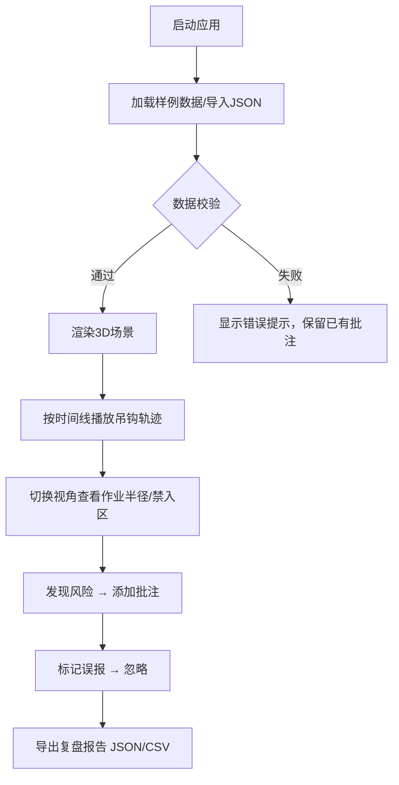
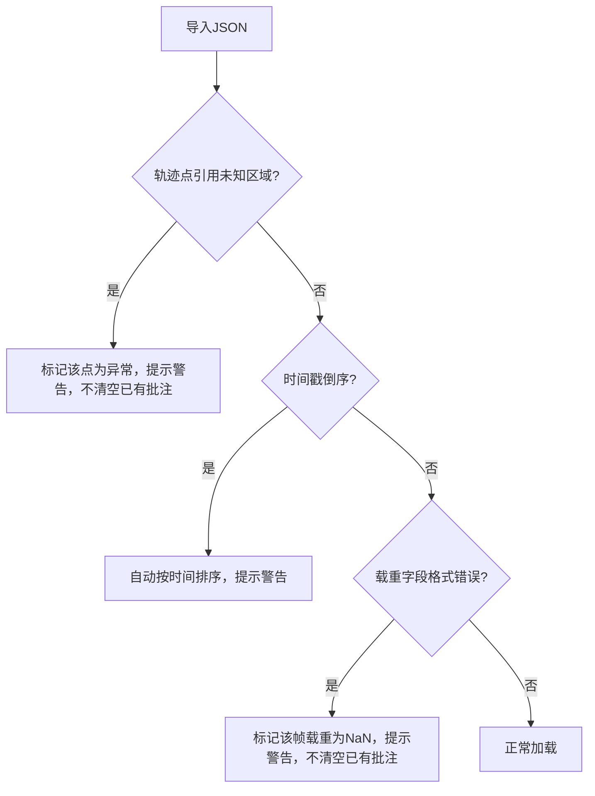

## 1. 产品概述

工地吊装路径 3D 复盘工具是一款面向施工现场安全管理人员的专业复盘应用。通过导入吊装作业 JSON 数据，在 3D 场景中按时间线回放吊钩轨迹、载重变化、作业半径和禁入区，支持风险批注与误报忽略，最终导出复盘报告。

- 核心问题：传统吊装复盘依赖 2D 图纸和表格，无法直观呈现三维空间中的轨迹冲突与安全风险
- 目标用户：施工现场安全管理人员、吊装工程师、监理人员

## 2. 核心功能

### 2.1 用户角色

| 角色 | 使用方式 | 核心权限 |
|------|----------|----------|
| 安全管理员 | 直接打开本地页面 | 导入数据、播放复盘、添加批注、导出报告 |
| 吊装工程师 | 直接打开本地页面 | 导入数据、播放复盘、查看风险 |

### 2.2 功能模块

1. **3D 场景页**：吊车模型、吊钩轨迹线、作业半径扇面、禁入区半透明围栏、地面网格、环境光照
2. **数据导入面板**：拖拽/选择 JSON 文件导入，实时校验反馈，样例数据一键加载
3. **时间线控制栏**：播放/暂停、进度拖拽、倍速切换、当前时间/载重/半径实时显示
4. **视角控制面板**：预设视角切换（俯视/侧视/跟随吊钩/自由）、摄像机预设保存与恢复
5. **风险批注面板**：风险列表、添加/编辑批注、标记忽略、筛选显示
6. **导出面板**：导出 JSON/CSV 复盘报告，隐藏已忽略风险

### 2.3 页面详情

| 页面名称 | 模块名称 | 功能描述 |
|----------|----------|----------|
| 3D 复盘主页面 | 3D 场景 | Three.js 渲染的吊装场景，包含吊车、吊钩轨迹、作业半径、禁入区 |
| 3D 复盘主页面 | 数据导入面板 | 拖拽上传 JSON，校验错误提示，样例数据加载按钮 |
| 3D 复盘主页面 | 时间线控制栏 | 底部播放控制条，含播放/暂停、进度条拖拽、倍速、实时数据 |
| 3D 复盘主页面 | 视角控制面板 | 右上角视角预设按钮，保存自定义视角 |
| 3D 复盘主页面 | 风险批注面板 | 右侧面板，风险列表、批注编辑、忽略切换、筛选 |
| 3D 复盘主页面 | 导出面板 | 顶部工具栏导出按钮，选择格式（JSON/CSV），忽略状态过滤 |

## 3. 核心流程

### 3.1 主流程：导入 → 播放 → 批注 → 导出

### 3.2 错误处理流程

## 4. 用户界面设计

### 4.1 设计风格

- **主色调**：工业深蓝 (#0A1628) + 安全橙 (#FF6B35) 作为警告强调色
- **辅助色**：钢灰 (#2D3748)、禁入红 (#E53E3E)、安全绿 (#38A169)
- **按钮风格**：圆角矩形，微阴影，hover 时轻微上浮
- **字体**：JetBrains Mono（数据/代码）+ Noto Sans SC（界面文字）
- **布局风格**：左侧 3D 主视图 + 右侧面板 + 底部时间线 + 顶部工具栏
- **图标风格**：线性图标（Lucide React），与工业主题统一

### 4.2 页面设计概述

| 页面名称 | 模块名称 | UI 元素 |
|----------|----------|---------|
| 3D 复盘主页面 | 3D 场景 | 深色背景、网格地面、吊车线框模型、轨迹渐变线、半透明禁入区、作业半径扇面 |
| 3D 复盘主页面 | 数据导入面板 | 拖拽区域虚线边框、文件名校验指示、错误红色提示、样例加载按钮 |
| 3D 复盘主页面 | 时间线控制栏 | 底部固定栏、播放/暂停图标按钮、进度条可拖拽、倍速下拉、载重/半径数值实时显示 |
| 3D 复盘主页面 | 视角控制面板 | 右上角浮动按钮组、预设视角图标、自定义保存输入框 |
| 3D 复盘主页面 | 风险批注面板 | 右侧可折叠面板、风险卡片列表、编辑图标、忽略开关、筛选下拉 |
| 3D 复盘主页面 | 导出面板 | 顶部工具栏下拉菜单、JSON/CSV 选项、忽略过滤复选框 |

### 4.3 响应式设计

- 桌面优先设计，最小支持 1280×720
- 右侧面板可折叠以适配较小屏幕
- 3D 场景自适应填充可用空间

### 4.4 3D 场景指引

- **环境**：深蓝色天空渐变，工业夜景氛围
- **光照**：环境光 + 方向光 + 点光源模拟施工现场照明
- **摄像机**：OrbitControls 自由旋转，预设位置快速切换
- **吊车模型**：简化几何体组合（塔身 + 吊臂 + 吊钩），工业橙色
- **轨迹线**：渐变管线（时间越近越亮），带箭头方向指示
- **禁入区**：半透明红色立方体/圆柱体，边缘发光
- **作业半径**：半透明扇面，随吊臂旋转动态更新
- **地面**：网格辅助线，带标尺刻度
