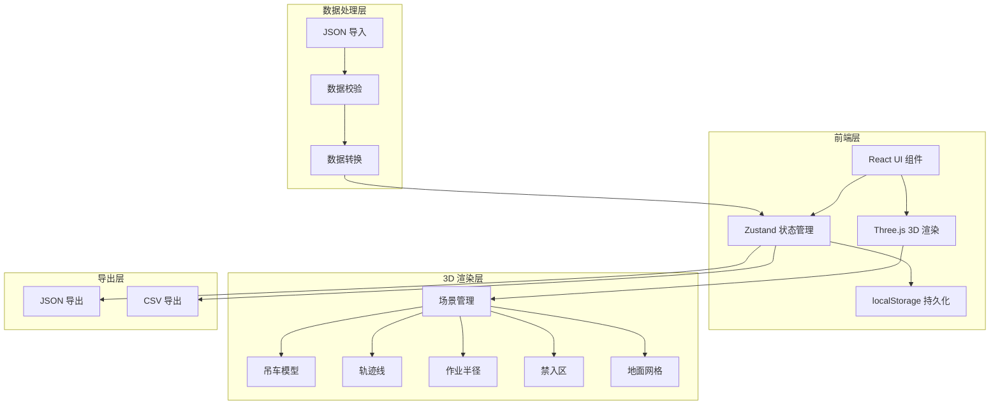
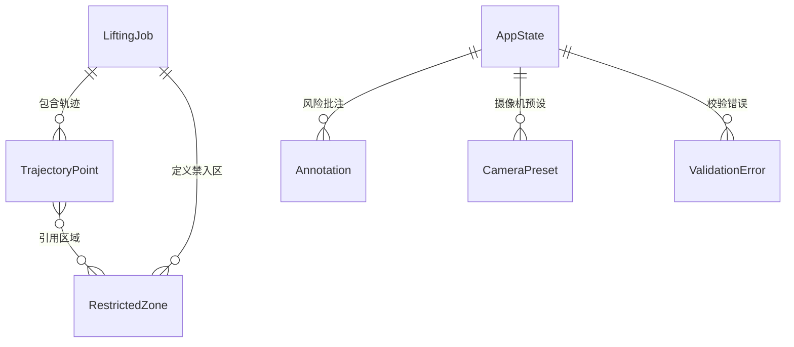

## 1. 架构设计



## 2. 技术说明

- **前端框架**：React 18 + TypeScript + Vite
- **3D 渲染**：three + @react-three/fiber + @react-three/drei
- **状态管理**：zustand（含 zustand/middleware persist 中间件）
- **样式**：tailwindcss@3
- **图标**：lucide-react
- **后端**：无（纯前端，数据通过 JSON 文件导入/导出）
- **持久化**：localStorage（摄像机预设、风险批注、忽略状态）

## 3. 路由定义

| 路由 | 用途 |
|------|------|
| / | 3D 复盘主页面（单页应用） |

## 4. 数据模型

### 4.1 吊装作业 JSON Schema

```typescript
interface LiftingJob {
  meta: {
    name: string;
    date: string;
    craneId: string;
    craneType: string;
    siteName: string;
  };
  crane: {
    position: [number, number, number];
    boomLength: number;
    boomAngle: number;
    maxRadius: number;
  };
  restrictedZones: RestrictedZone[];
  trajectory: TrajectoryPoint[];
}

interface RestrictedZone {
  id: string;
  name: string;
  type: "cylinder" | "box";
  position: [number, number, number];
  size: {
    radius?: number;
    height?: number;
    width?: number;
    depth?: number;
  };
  color?: string;
}

interface TrajectoryPoint {
  timestamp: number;
  hookPosition: [number, number, number];
  boomAngle: number;
  load: number;
  radius: number;
  zoneIds?: string[];
  riskLevel?: "safe" | "warning" | "danger";
  note?: string;
}
```

### 4.2 应用状态模型

```typescript
interface AppState {
  job: LiftingJob | null;
  currentTime: number;
  isPlaying: boolean;
  playbackSpeed: number;
  cameraPresets: CameraPreset[];
  annotations: Annotation[];
  ignoredRiskIds: string[];
  showIgnored: boolean;
  errors: ValidationError[];
}

interface CameraPreset {
  id: string;
  name: string;
  position: [number, number, number];
  target: [number, number, number];
}

interface Annotation {
  id: string;
  timestamp: number;
  position: [number, number, number];
  riskLevel: "safe" | "warning" | "danger";
  text: string;
  ignored: boolean;
  createdAt: string;
}

interface ValidationError {
  type: "unknown_zone" | "timestamp_reverse" | "invalid_load";
  message: string;
  pointIndex?: number;
}
```

### 4.3 数据关系图



## 5. 关键技术决策

### 5.1 3D 渲染方案

- 使用 @react-three/fiber 将 Three.js 集成到 React 组件树
- 使用 @react-three/drei 提供 OrbitControls、Line、Html 等辅助组件
- 吊车模型使用基础几何体组合（CylinderGeometry + BoxGeometry），无需外部模型文件
- 轨迹线使用 drei 的 Line 组件，支持渐变色
- 禁入区使用半透明 MeshStandardMaterial + EdgesGeometry 描边

### 5.2 状态持久化

- Zustand persist 中间件自动同步到 localStorage
- 摄像机预设、风险批注、忽略状态在页面刷新后自动恢复
- 导入新数据时不清空批注和预设

### 5.3 数据校验策略

- 轨迹点引用未知区域：标记警告，保留该点但标注异常
- 时间戳倒序：自动排序并提示
- 载重字段格式错误：标记为 NaN，不影响其他数据
- 坏数据不能清空已有批注：校验失败时仅追加错误信息，不重置批注状态

### 5.4 导出策略

- JSON 导出：包含完整轨迹数据 + 可见风险批注（过滤已忽略）
- CSV 导出：轨迹点表格 + 风险批注表格（过滤已忽略）
- 导出内容与当前可见复盘状态一致
